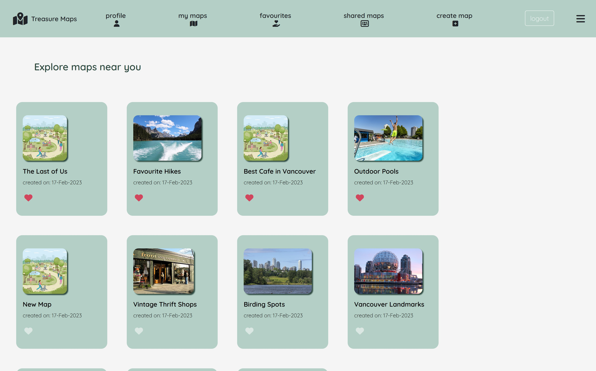
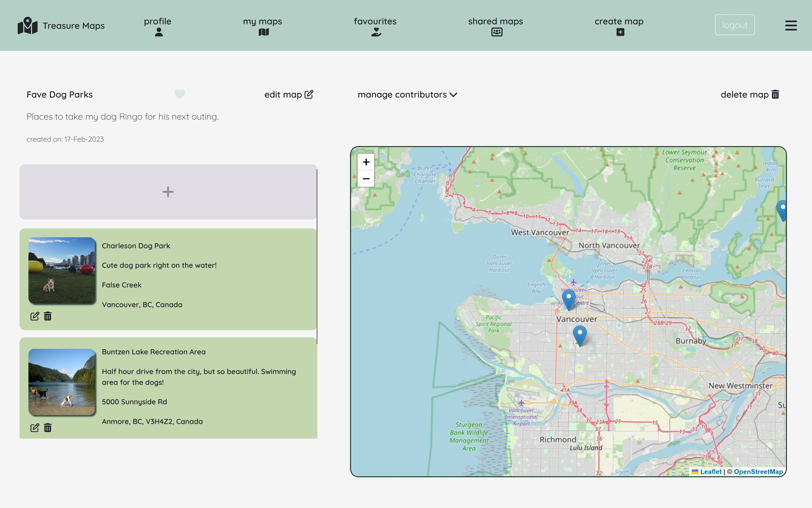
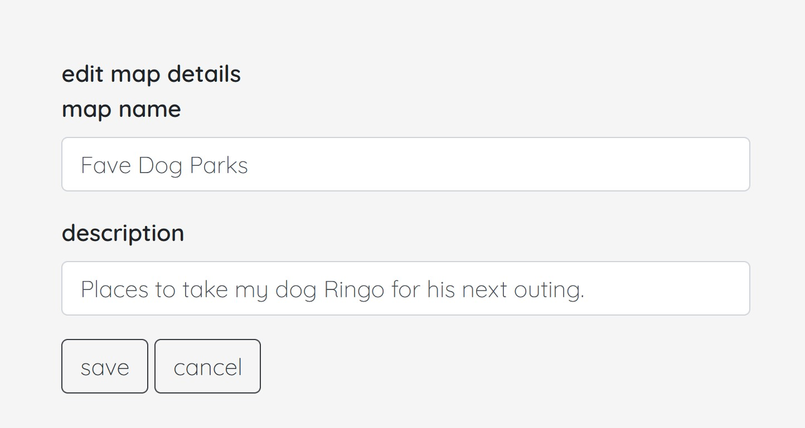
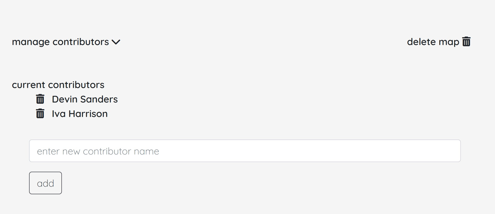
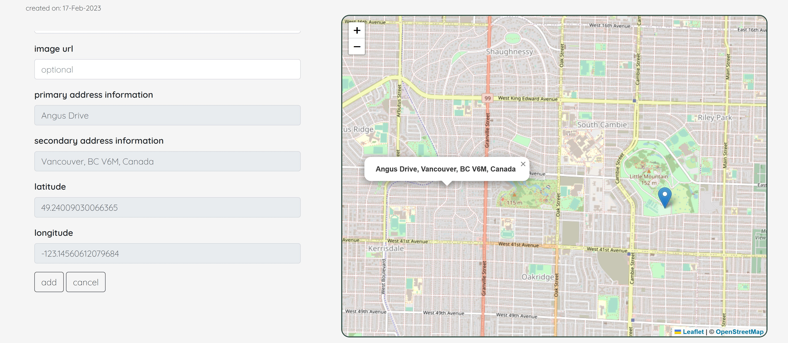
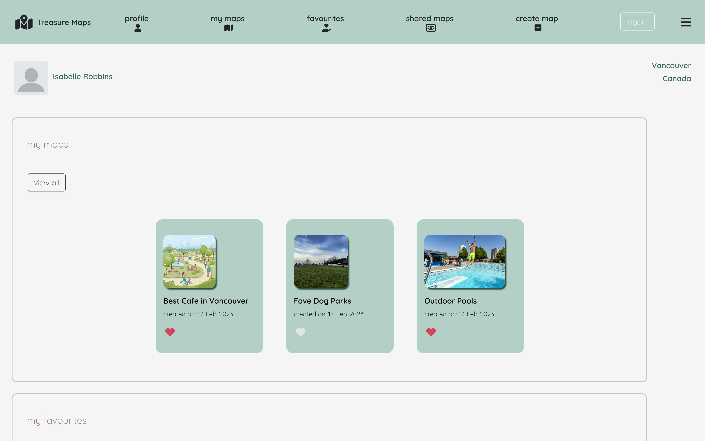
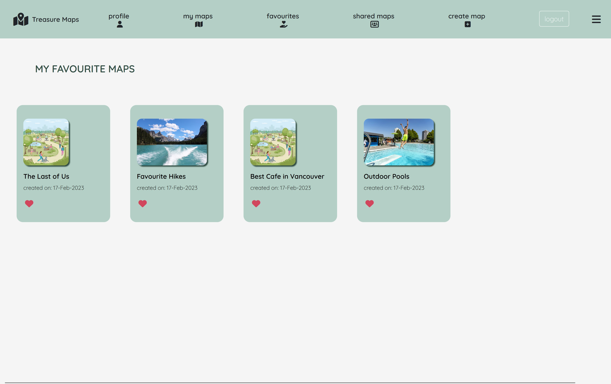
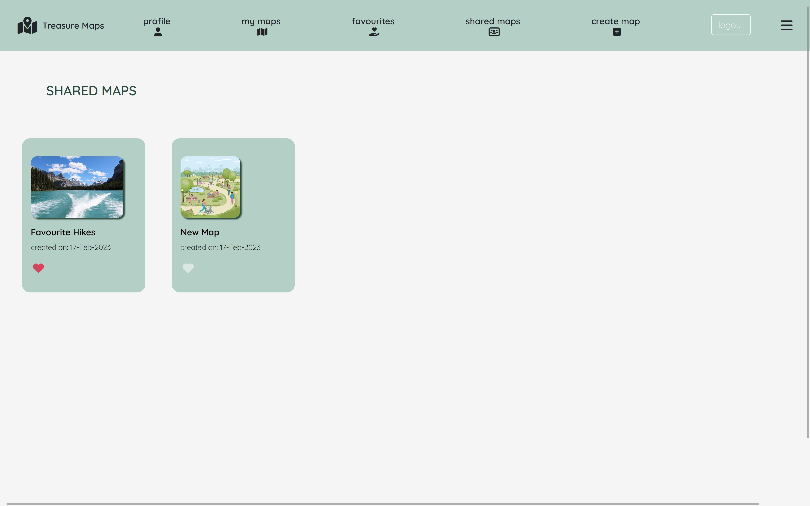
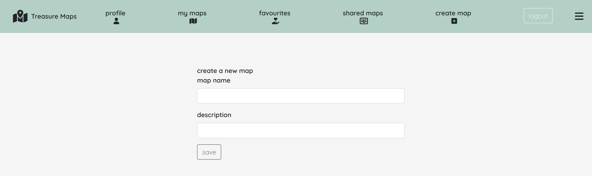

# 
# PROJECT TITLE - Treasure Map (wiki map)

## PROJECT DESCRIPTION
A responsive web app that allows users to collaboratively create maps which list multiple "points". For example: "Best Places to Eat Around Town" or "Locations of Movie Scenes".

## TEAM MEMBERS
**Khin Mo Mo Zin, Katherine Nishimura**

# TECH STACK #

## Languages, Frameworks & Database ##


## API & External Libraries ##
<div style="display: flex; margin-bottom:15px">
  
  
</div>


## Others


# PROJECT OVERVIEW #

## Home Page 
### Home page after user logged in showing the map near user's location ###


## Map Detail Page 
### Clicking on individual map will take you to map detail page where you can see Point added to current map ###


## Map Detail Page - Edit Map Details
### User can edit current map info like name and description of the map ###


## Map Detail Page - Add contributor 
### Map owner can add other existing users to be the contributor of the map, that mean they can add in points to the map too ###


## Map Detail Page - Add new point
### User can add new point to current map by click anywhere on the map, that will populate the fields with deatils information of selected location ###


## User Profile
### User can view the maps they created, favourited or been shared by another user as a contributor ###


## Favourite Map Page
### User can view all the map they marked as favourite ###


## Share/Contributed Map Page
### User can view all the map taht has been shared by another user as a contributor and add points in it ###


## Create New Map
### User can create a new map and add points later from detail page ###


# PROJECT SETUP #

## DB SETUP
```
psql
CREATE DATABASE midterm;
```

## PROJECT SETUP
```
cd wikimap
npm install
npm rebuild node-sass
npm run db:reset
npm run local
```

Visit `http://localhost:8080/`

## Dependencies

- Node 10.x or above
- NPM 5.x or above
- PG 6.x
